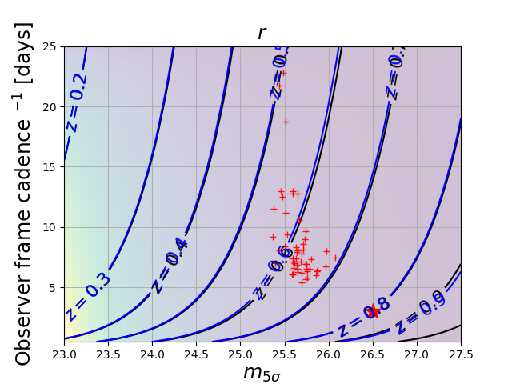
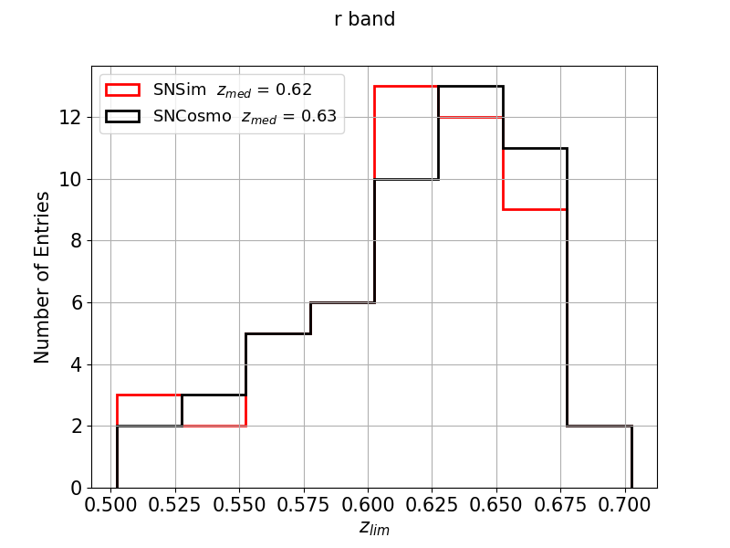
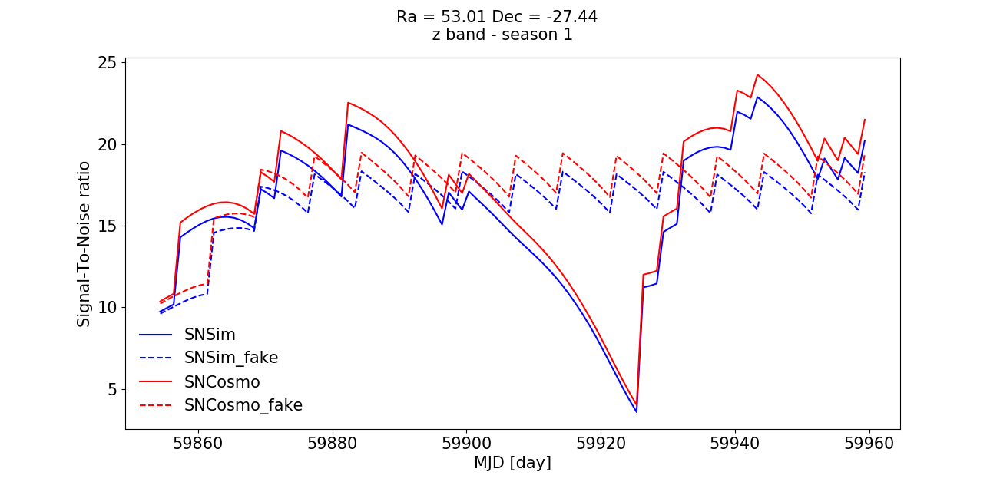

# sn_pipe

A framework to run the Survey Strategy Support pipeline.

## **Instruction for installation**

### Getting the package from github

 git clone -b thebranch https://github.com/lsstdesc/sn_pipe
 
 where thebranch is the branch you would like to use (main, dev, dev_stable, ...)

### Environnement setup
 - The pipeline uses lsst_sim package
 - cernvmfs may be used to have some lsst_sim releases available.
 - to install cvmfs: https://sw.lsst.eu/installation.html
 - ls /cvmfs/sw.lsst.eu/linux-x86_64/lsst_sims/ -> provides a list of lsst_sim releases available.
 - The "setup" is done this way:
   - source /cvmfs/sw.lsst.eu/linux-x86_64/lsst_sims/sims_w_2019_20/loadLSST.bash
   - setup lsst_sims

**Important : you have to make this setup prior to any operations described below**

## **Running the metrics**

### Installing requested packages
- pip install . --user --install-option="--package=metrics" --install-option="--branch=thebranch"

### Running the Cadence metric
- a notebook illustrating how to run the metric is available in the notebook directory (SNCadence.ipynb) of sn_pipe
- Command line:
  - python run_scripts/run_cadence_metric.py input/param_cadence_metric.yaml
  - A description of the input yaml file is given [here](doc/yaml_cadence.md)
  - you may have to change the 'filename' parameter to the OpSim db name you would like to use as input.
- output : a set of plots: 
- Mean cadence vs mean m5 (5-sigma depth) 
- Histogram of redshift limits 

### Running the Signal-to-Noise Ratio (SNR) metric
- a notebook illustrating how to run the metric is available in the notebook directory (SNSNR.ipynb) of sn_pipe
- Command line:
  -  python run_scripts/run_snr_metric.py input/param_snr_metric.yaml
  - A description of the input yaml file is given [here](doc/yaml_snr.md)
  - you may have to change the 'filename' parameter to the OpSim db name you would like to use as input.
 - output : a set of plots:
   - SNR vs Time (per band and per season) 

## **Running the simulations**

### Installing requested packages
- pip install . --user --install-option="--package=simulation" --install-option="--branch=thebranch"

### Light Curves simulation
- a notebook illustrating how to run the simulation and vizualized outputs is available in the notebook directory (SNSimulation.ipynb) of sn_pipe
- command line:
  - python run_scripts/run_simulation.py input/param_simulation.yaml
- output: two files, hdf5 format:
  - Simu_*.hdf5: astropy table with the list of parameters used for simulation
  - LC*.hdf5: list of (astropy tables) light curves. Each table is composed of metadata (simulation parameters) and of a table with LC points.  
