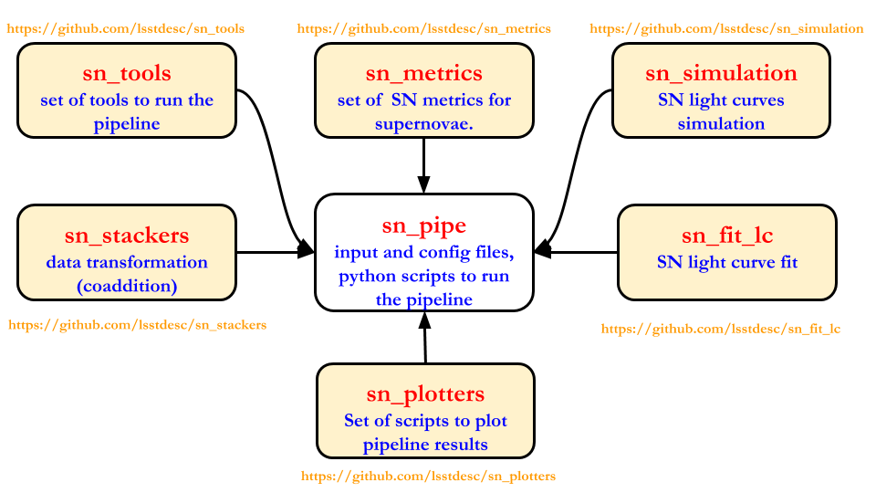

# sn_pipe

A framework to run the Survey Strategy Support pipeline.

```
This software was developed within the LSST DESC using LSST DESC resources, and so meets the criteria 
given in, and is bound by, the LSST DESC Publication Policy for being a "DESC product". 
We welcome requests to access code for non-DESC use; if you wish to use the code outside DESC 
please contact the developers.

```
## Release Status
|Release|Date|
|---|---|
|v1.0.0|2020/07/15|


## Feedback, License etc

If you have comments, suggestions or questions, please [write us an issue](https://github.com/LSSTDESC/sn_pipe/issues).

This is open source software, available for re-use under the modified BSD license.

```
Copyright (c) 2020, the sn_pipe contributors on GitHub, https://github.com/LSSTDESC/sn_pipe/graphs/contributors.
All rights reserved.
```

## Overview of the pipeline



## Getting the package from github
```
 git clone https://github.com/lsstdesc/sn_pipe (master)
or
git clone -b <tag_name> https://github.com/lsstdesc/sn_pipe (release tag_name)
 ```

## Installation 

```
Installation of sn_pipe: python pip_sn_pack.py --action install --package=sn_pipe
```

The Survey Strategy Support pipeline is supposed to be modular, in the sense that only needed git packages are installed for a given task. The current tasks that may be run are:

| Task | package | command for installation|
|----|----|----|
| SN metrics | sn_metrics | python pip_sn_pack.py --action install --package=sn_metrics |
| LC simulations | sn_simulation|python pip_sn_pack.py --action install --package=sn_simulation |
| LC fit | sn_fit_lc |python pip_sn_pack.py --action install --package=sn_fit |
| Plot | sn_plotters |python pip_sn_pack.py --action install --package=sn_plotters |
|all | all | python pip_sn_pack.py --action install --package=all| 

To uninstall the pipeline: python pip_sn_pack.py --action uninstall --package=all 

## How to

### [Run and analyze the metrics](docs/Metrics/Metrics.md)

### [Run and analyze light curve simulation](docs/Simulation/Simulation.md)

### [Run and analyze light curve fitting](docs/Fit/Fit.md)


## sn_pipe structure

### [sn_pipe content](docs/Gen/sn_pipe.md)

###  [sn_pipe full tree](docs/Gen/sn_pipe_fulltree.md)

##

