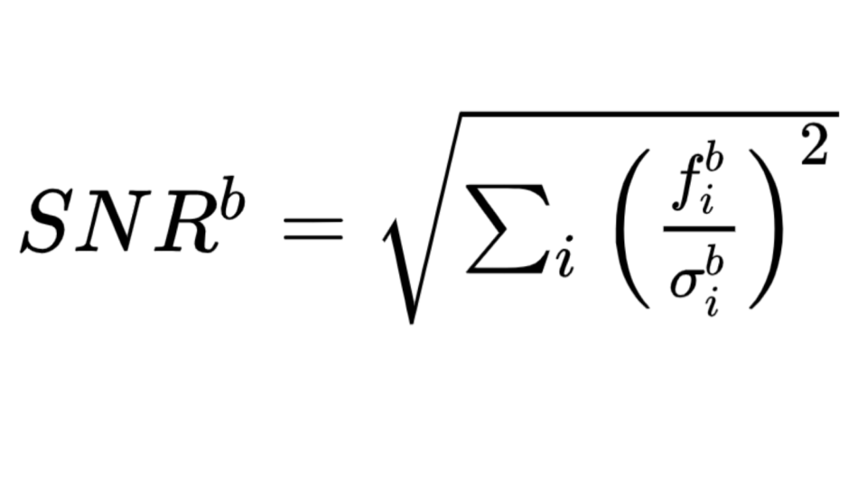
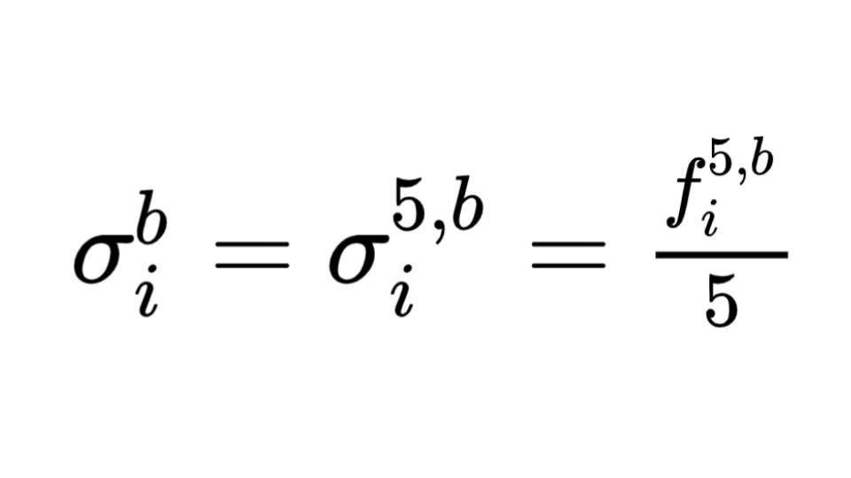
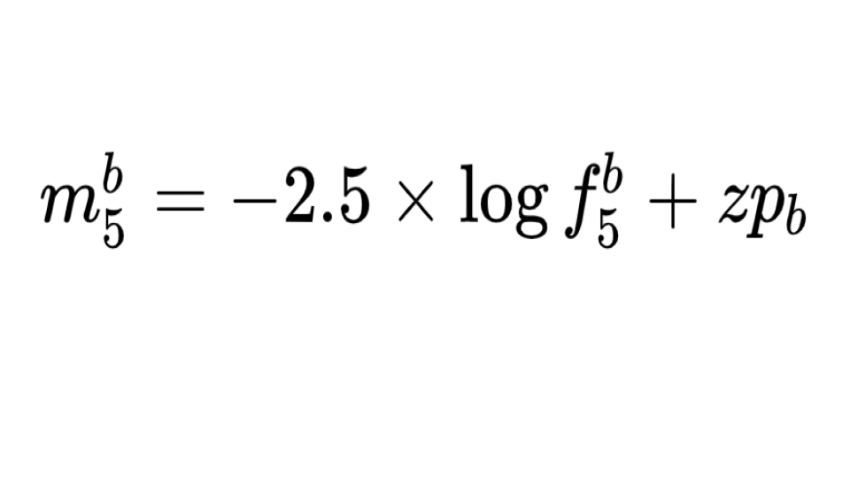

# ObsRate metric

## Definition
This metric is an estimate of the observation rate of faint [(x1,color) = (-2.0,0.2)] using gri (default) bands. It is defined as the fraction of supernovae with minimal SNR per band.

Let us suppose that we have a set of measurements of (fluxes,error fluxes): (f<sub>i</sub>,&sigma;<sub>i</sub>). Then the Signal-to-Noise Ratio (SNR) may be written, per band b:



In the background-dominating regime, one has:



where f<sub>i</sub><sup>5,b</sup> is the 5-&sigma; flux related to the 5&sigma; depth (m<sub>5</sub>) by:



Since m<sub>5</sub> is given by observing conditions, it is possible to estimate SNR<sup>b>/sup> provided a flux template for supernovae is available.

## Installation of the metric package

```
python pip_sn_pack.py --action install --package=sn_metrics
```

## Input parameters

- x1
- color
 - band
 - SNRs
 - Li_files : list of npy files with light curves
 - mag_to_flux : list of npy files with mag to flux conversion

This metric may be run yearly, per season or using the complete survey.

## How to run this metric

 - use the script [run_metrics.py](usage_run_metrics.md)

## Output analysis

The analysis/display of the metric results can be done using the sn_plotters package that can be installed as follow:

```
python pip_sn_pack.py --action install --package=sn_plotters
```

The script [plot_snr_metric.py](../Plots/usage_plot_snr_metric.md) may be used to display the results.