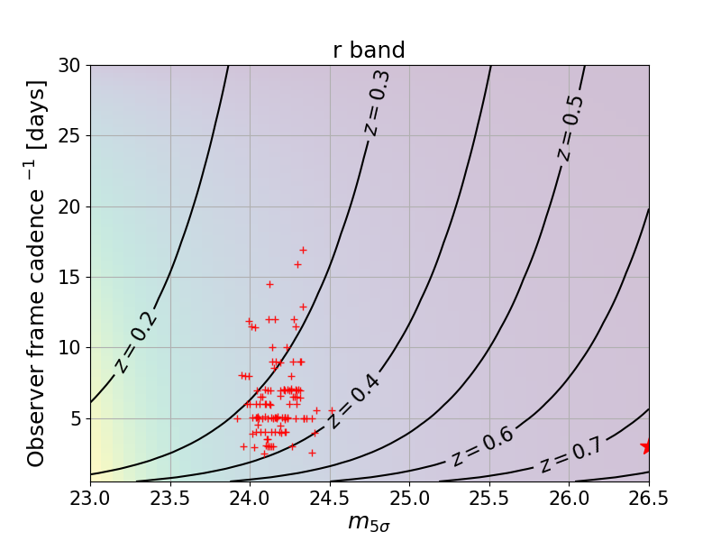
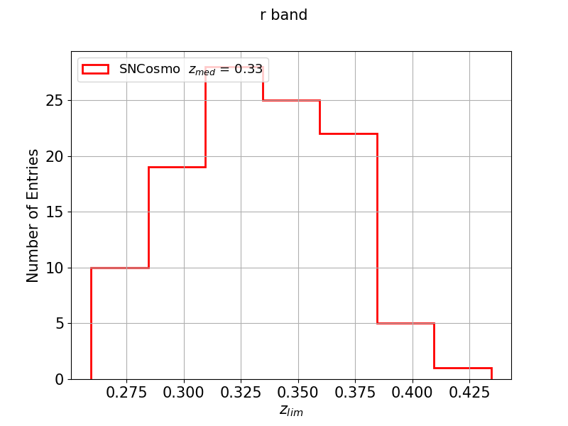
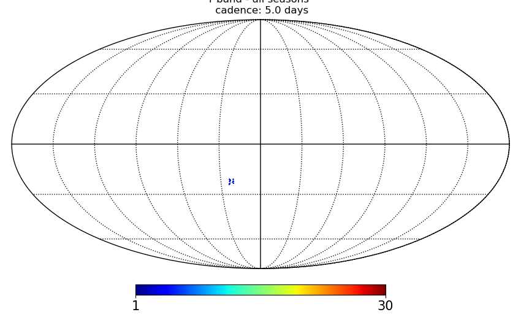

## Usage: plot_cadence_metric.py [options]

<pre>
Display Cadence metric results

Options:
  -h, --help            show this help message and exit
  --dbName=DBNAME       db name [kraken_2026]
  --dirFile=DIRFILE     file directory []
  --band=BAND           band [r]
  --x1=X1               SN x1 [-2.0]
  --color=COLOR         SN color [0.2]
  --fieldtype=FIELDTYPE
                        file directory [WFD]
  --nside=NSIDE         file directory [64]
  --web_path=WEB_PATH   url where to find some files necessary to
                        run[https://me.lsst.eu/gris/DESC_SN_pipeline]
</pre>

## Example
<ul>
<li> Plot the results from the processing of observing strategy descddf_v1.5_10yrs. Files are located in the directory MetricOutput:
<ul>
<li> python plot_scripts/metrics/plot_cadence_metric.py  --dirFile MetricOutput --dbName descddf_v1.5_10yrs
<li> The following plots should be displayed
</ul>
	
     	
     	
     	
</ul>