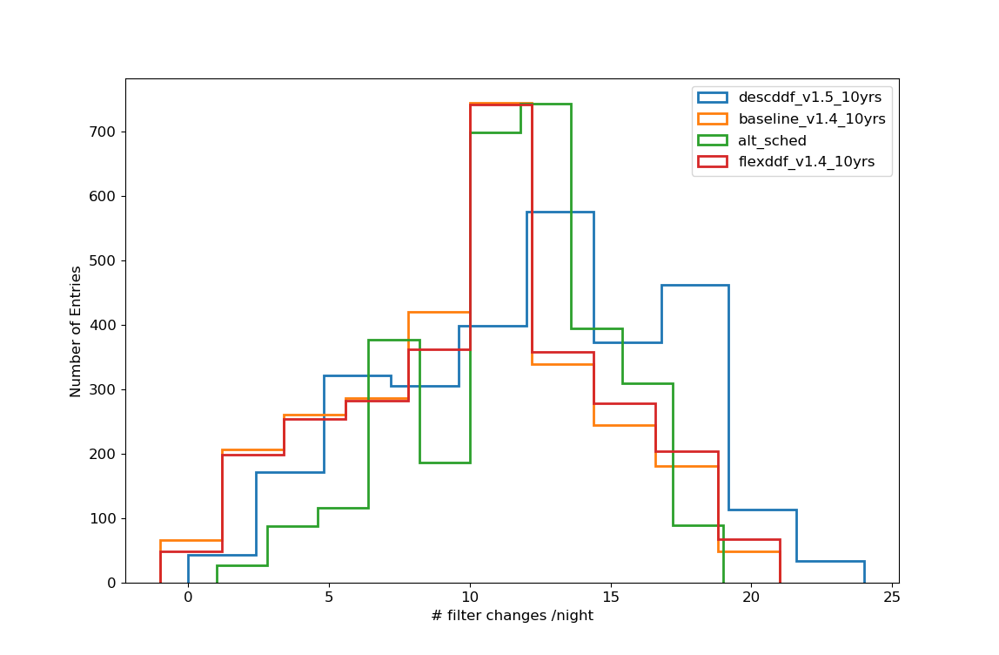

## Usage: plot_global.py [options]

<pre>
Display Global metric results

Options:
  -h, --help           show this help message and exit
  --listPlot=LISTPLOT  db name [plot_scripts/input/cadenceCustomize.csv]
  --dirFile=DIRFILE    file directory []
 </pre>

## Example
 - Let us suppose that the Global metric was run on the following observing strategies: alt_sched,baseline_v1.4_10yrs,descddf_v1.5_10yrs,flexddf_v1.4_10yrs and that output files are in the directory GlobalOutput. To display the results, one needs first to build a csv file (example given in plot_scripts/input/cadenceCustomize.csv) with the list of observing strategies to display and other parameters. Then the command:
   - python plot_scripts/metrics/plot_global.py --dirFile GlobalOutput --listPlot plot_scripts/input/cadenceCustomize.csv
 will display a set of plots related to the Global metric:
 

     
     
  

  
  
  
  
     
     
