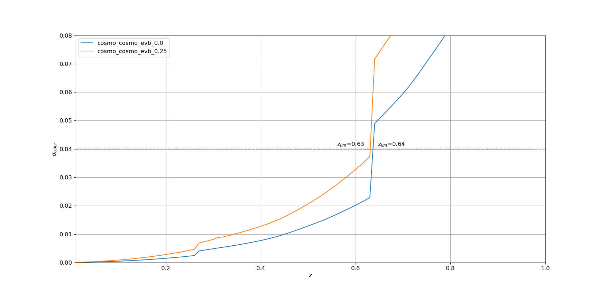

### Usage: plot_lcfit.py [options] ###
<pre>

Options:
  -h, --help         show this help message and exit
  --prodids=PRODIDS  prodid [input/plots/podids_fit.csv]

</pre>

### Examples ###
<li>
<ul>
<li> Let us suppose that LC fit have been performed and the results are located in a directory Output_Fit:

ls Output_Fit   
Fit_sn_cosmo_Fake_Fake_DESC_seas_-1_-2.0_0.2_380_800_ebvofMW_0.0_sn_cosmo.hdf5 
Fit_sn_cosmo_Fake_Fake_DESC_seas_-1_-2.0_0.2_380_800_ebvofMW_0.25_sn_cosmo.hdf5

<li> The prodids are then defined by
<ul>
<li> sn_cosmo_Fake_Fake_DESC_seas_-1_-2.0_0.2_380_800_ebvofMW_0.0_sn_cosmo </li>
 <li> sn_cosmo_Fake_Fake_DESC_seas_-1_-2.0_0.2_380_800_ebvofMW_0.25_sn_cosmo </li>
</ul>
<li> The inputfile for the display will thus look like:

cat prodids.cvs
```
nickname,dirname,prodid  
cosmo_cosmo_evb_0.0,Output_Fit,sn_cosmo_Fake_Fake_DESC_seas_-1_-2.0_0.2_380_800_ebvofMW_0.0_sn_cosmo 
cosmo_cosmo_evb_0.25,Output_Fit,sn_cosmo_Fake_Fake_DESC_seas_-1_-2.0_0.2_380_800_ebvofMW_0.25_sn_cosmo 
```
where the "nickname" is chosen by the user (it will be used as legend on the plot)

<li> To display the results: python plot_scripts/lcfit/plot_lcfit.py --dirFile Output_Fit --prodids prodids.csv. By default, sigma_Color vs z is displayed:
<p align="center">
     
</p>

</li>