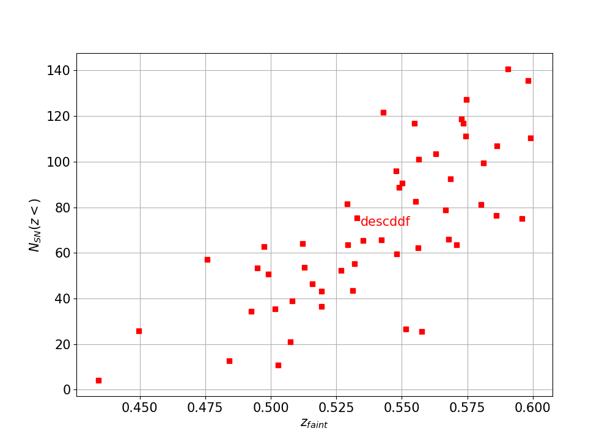
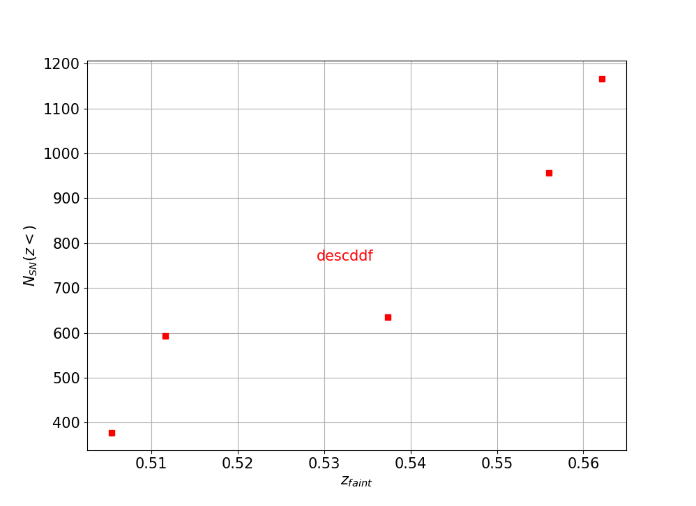
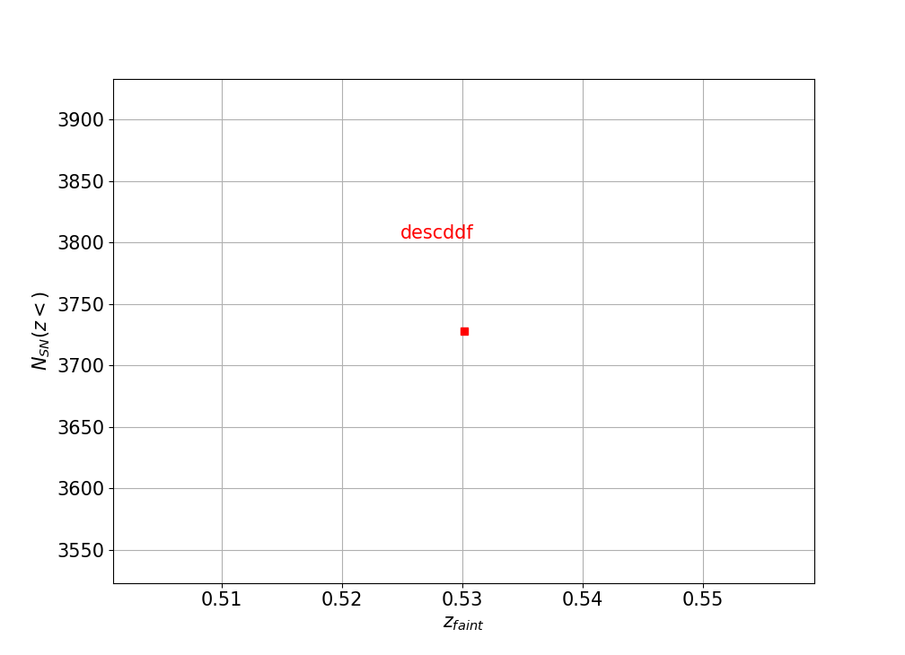

### Usage: plot_nsn_metric_DD_summary.py [options] ###
<pre>
Display (NSN,zlim) metric results for DD fields

Options:
  -h, --help            show this help message and exit
  --dirFile=DIRFILE     file directory [/sps/lsst/users/gris/MetricOutput]
  --nside=NSIDE         nside for healpixels [128]
  --fieldType=FIELDTYPE
                        field type - DD, WFD, Fake [DD]
  --dbList=DBLIST       list of cadences to
                        display[plot_scripts/cadenceCustomize_fbs14.csv]
  --snType=SNTYPE       SN type: faint or medium[faint]
  --outName=OUTNAME     output name for the summary[Summary_DD_fbs14.npy]

</pre>

### Examples ###

<ul>
<li>  Plot the (NSN,zlim) results for files located in MetricOutput generated with nside=64 for a faint supernova. The list of files to display (with other parameters) are in plot_scripts/input/cadenceCustomize_fbs14.csv. 
      <ul>
     <li>python plot_scripts/metrics/plot_nsn_metric_DD_summary.py --dirFile MetricOutput --nside 64 --dbList plot_scripts/input/cadenceCustomize_fbs14.csv
     <li> This command should display three plots (NSN, zlim) : for each field/season, for each field (NSN=sum(NSN), zlim = median(zlim)) and for each OS (NSN=sum(NSN), zlim = median(zlim)). Here is an illustration for OS descddf fbs1.4:
     </ul>
     

     
     
     
     

     
 </li>
 <ul>