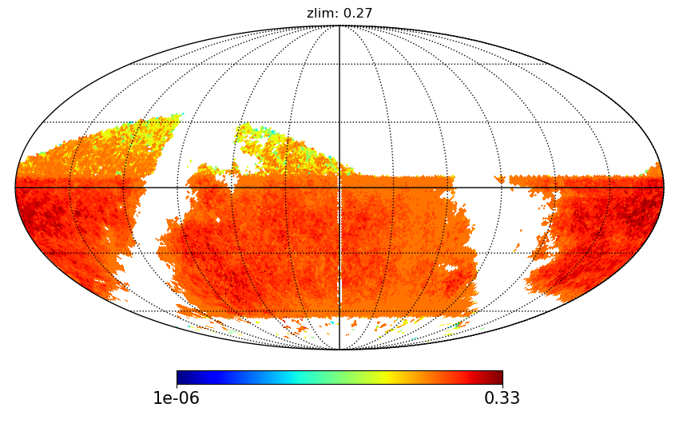
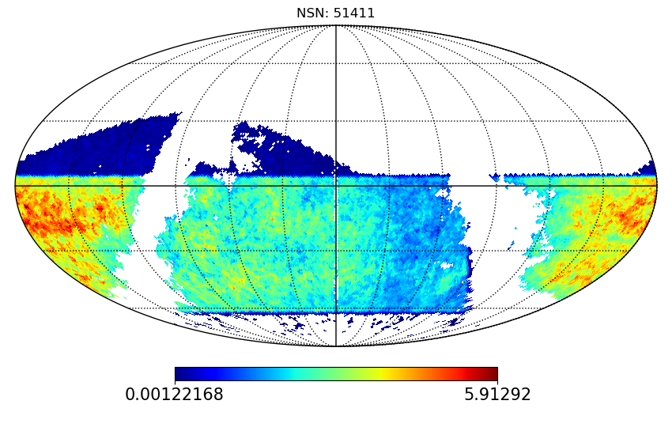
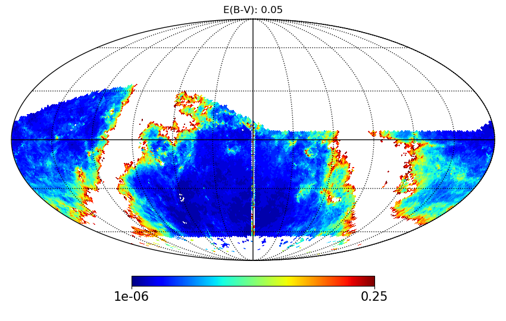
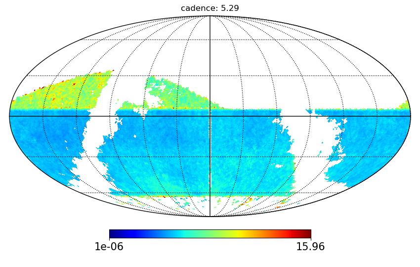
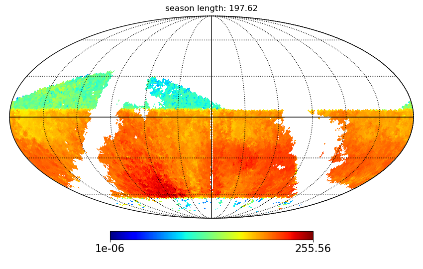

### Usage: plot_nsn_metric_OS.py [options] ###
<pre>

Options:
  -h, --help         show this help message and exit
  --dirFile=DIRFILE     file directory [/sps/lsst/users/gris/MetricOutput]
  --nside=NSIDE         nside for healpixels [64]
  --fieldType=FIELDTYPE
                        field type - DD, WFD, Fake [WFD]
  --dbName=DBNAME       dbname to process [descddf_v1.4_10yrs]

</pre>

### Examples ###

<ul>
<li>   If the NSN has been run on the OS baseline_nexp1_v1.6_10yrs and if output files are located in the directory ../Files than to plot metric results:
      <ul>
     <li> python plot_scripts/metrics/plot_nsn_metric_OS.py --dirFile ../Files --dbName baseline_nexp1_v1.6_10yrs
     <li> This command should display the following plots. The user can choose to plot other variables by modifying the script plot_scripts/metrics/plot_nsn_metric_OS.py.
     </ul>
     

     
     
     
     
     
     

     
 </li>
 <ul>
