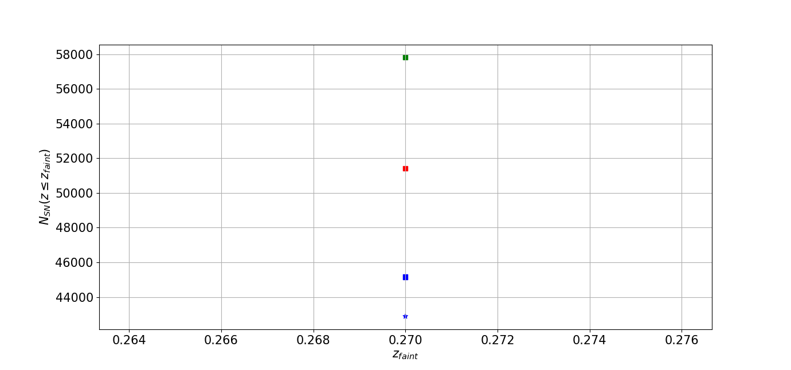

### Usage: plot_nsn_metric_WFD_summary.py [options] ###
<pre>
Display NSN metric results for WFD fields

Options:
  -h, --help            show this help message and exit
  --dirFile=DIRFILE     file directory [/sps/lsst/users/gris/MetricOutput]
  --nside=NSIDE         nside for healpixels [64]
  --fieldType=FIELDTYPE
                        field type - DD, WFD, Fake [WFD]
  --nPixelsFile=NPIXELSFILE
                        file with the total number of pixels per obs.
                        strat.[ObsPixels_fbs14_nside_64.npy]
  --listdb=LISTDB       list of dbnames to process
                        [plot_scripts/input/WFD_test.csv]
  --tagbest=TAGBEST     tag for the best OS [snpipe_a]

  

</pre>

### Examples ###

<ul>
<li>  Plot the (NSN,zlim) results for files located in MetricOutput generated with nside=64 for a faint supernova for WFD surveys. Let us suppose that the metric has been run on the following OS: alt_base_v1.6_10yrs,baseline_nexp1_v1.6_10yrs,baseline_v1.4_10yrs,baseline_v1.5_10yrs and that output files are located in ../Files. Then we have to generate a csv file (WFD.csv) that looks like:

dbName,plotName,color,marker

alt_base_v1.6_10yrs,alt_base,b,*

baseline_nexp1_v1.6_10yrs,baseline_1.6,r,s

baseline_v1.4_10yrs,baseline_1.4,b,s

baseline_v1.5_10yrs,baseline_1.5,g,s 

<ul>
     <li>python plot_scripts/metrics/plot_nsn_metric_WFD_summary.py --dirFile ../Files --listdb WFD_test.csv
     <li> This command should display a summary plot (NSN, zlim) that will look like
     </ul>
     

     
     

<li> A ranking of observing strategies should also be available:
<table style="width:100%">
  <tr>
    <th>dbName</th>
    <th>nsn</th>
    <th>rank</th>
  </tr>
  <tr>
  <th>baseline_v1.5_10yrs</th>
    <th>57815</th>
    <th>1</th>
   </tr>
    <tr>
  <th>baseline_nexp1_v1.6_10yrs</th>
    <th>51411</th>
    <th>2</th>
   </tr>
    <tr>
  <th>baseline_v1.4_10yrs</th>
    <th>45157 </th>
    <th>3</th>
   </tr>
     <tr>
  <th>alt_base_v1.6_10yrs</th>
    <th>42888 </th>
    <th>4</th>
   </tr>
  </table>
 </li>
 <ul>