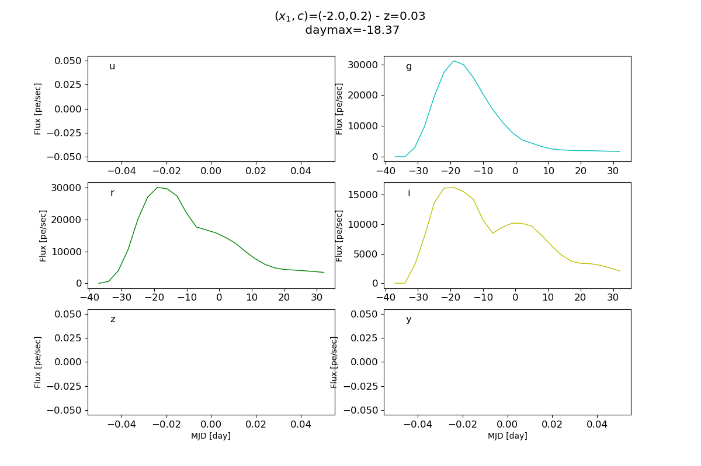

### Usage: plot_simu.py [options] ###
<pre>

Options:
  -h, --help         show this help message and exit
  --prodid=PRODID    prodid [alt_sched]
  --fileDir=FILEDIR  dir location of the results [Output_Simu]

</pre>

### Examples ###
<li> 
<ul>
Suppose that the sn_simulation process has been run and output files are located in a directory OutputSimu:
<li>
ls Output_Simu

LC_sn_cosmo_Fake_Fake_DESC_seas_-1_-2.0_0.2_380_800_ebvofMW_0.0.hdf5 
Simu_sn_cosmo_Fake_Fake_DESC_seas_-1_-2.0_0.2_380_800_ebvofMW_0.0.hdf5 
sn_cosmo_Fake_Fake_DESC_seas_-1_-2.0_0.2_380_800_ebvofMW_0.0.yaml
</li>
<li>
According to the simulation process, there are three files:
<ul>
<li> sn_cosmo_Fake_Fake_DESC_seas_-1_-2.0_0.2_380_800_ebvofMW_0.0.yaml: configuration parameters of the simulation
<li> Simu_sn_cosmo_Fake_Fake_DESC_seas_-1_-2.0_0.2_380_800_ebvofMW_0.0.hdf5: astropy table of the simulation parameters (with, in particular, a pointer to LC points for each set of parameters)
<li> LC_sn_cosmo_Fake_Fake_DESC_seas_-1_-2.0_0.2_380_800_ebvofMW_0.0.hdf5: set of astropy tables of LC points.
</ul>
</li>
</ul>
<ul> The "prodid" parameter for display is in this case given by sn_cosmo_Fake_Fake_DESC_seas_-1_-2.0_0.2_380_800_ebvofMW_0.0. To display the light curve, the command is thus: python plot_scripts/simulation/plot_simu.py --fileDir Output_Simu --prodid sn_cosmo_Fake_Fake_DESC_seas_-1_-2.0_0.2_380_800_ebvofMW_0.0. By default the script displays produced LC:

     

<ul>

</li>
