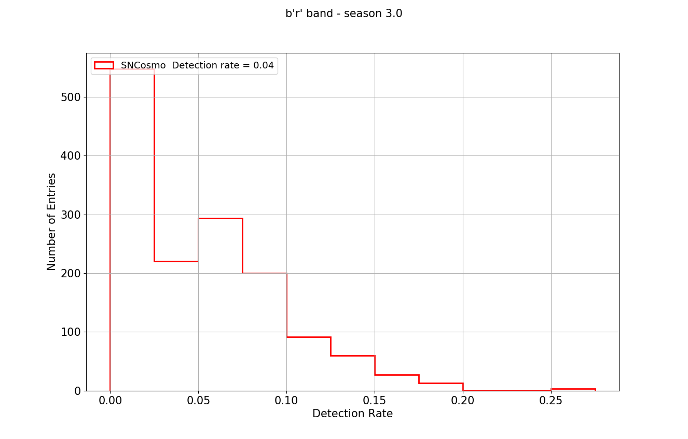

## Usage: plot_snr_metric.py [options]

<pre>
Display SNR metric results

Options:
  -h, --help            show this help message and exit
  --dbName=DBNAME       db name [kraken_2026]
  --dirFile=DIRFILE     file directory []
  --band=BAND           band [r]
  --fieldtype=FIELDTYPE
                        band [WFD]
  --metricName=METRICNAME
                        metric name[SNRMetric]
  --nside=NSIDE         nside from healpix [64]

</pre>

## Example
<ul>
<li> If the SNR metric has been process on descddf_v1.5_10yrs, r-band, WFD,  and if output files are located in the MetricOutput directory, then the following command:
<ul>
<li>
python plot_scripts/metrics/plot_snr_metric.py --dirFile MetricOutput --dbName descddf_v1.5_10yrs --metricName SNRr
 will lead to the histo display of the SNR metric:
 
</ul>

</li>
</ul>