## Usage:  plot_scripts/metrics/plot_DD_stat.py

<pre>
OS analysis plots from pointings

Options:
  -h, --help            show this help message and exit

--dirFile=DIRFILE     file directory
                        [../MetricOutput_DD_new_128_gnomonic_circular]

--nside=NSIDE         nside for healpixels [128]

--fieldType=FIELDTYPE
                        field type - DD, WFD, Fake [DD]

--dbList=DBLIST       list of cadences to display[List.csv]

--fieldNames=FIELDNAMES
                        fields to process [COSMOS,CDFS,XMM-
                        LSS,ELAISS1,EDFSa,EDFSb,EDFS]

--metric=METRIC       metric name [NSNY]

--pointingFile=POINTINGFILE
                        pointing file name [Summary_DD_pointings.hdf5]

--configGroup=CONFIGGROUP
                        pointing file name [DD_fbs_2.99_plot.csv]

--addMetric=ADDMETRIC
                        to add metric correlation plots [0]

--plotSummary=PLOTSUMMARY
                        to draw summary plots [0]

--dbName_night=DBNAME_NIGHT
                        dbName for night plot stat [baseline_v3.0_10yrs]

--fieldName_night=FIELDNAME_NIGHT
                        field for night plot stat [COSMOS]
</pre>

##example

python plot_scripts/metrics/plot_DD_stat.py --dirFile . --configGroup=DDF_fbs_multiple.csv --dbName_night=desc_ddf_v4.2.1_10yrs --plotSummary=1

The DDF_fbs_multiple.csv file is available [here](DDF_fbs_multiple.csv).

Plots produced:
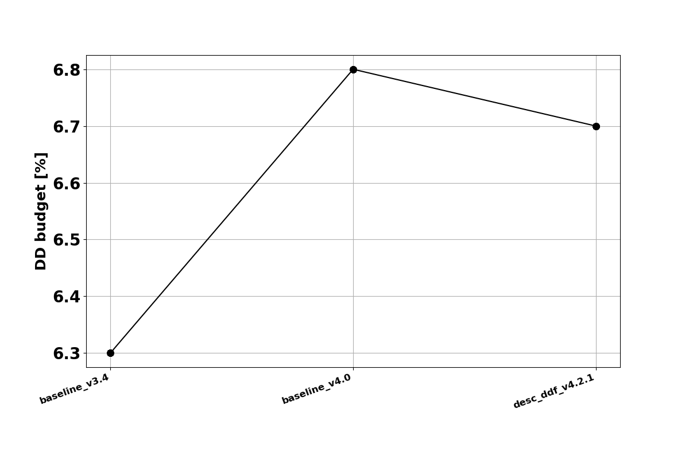
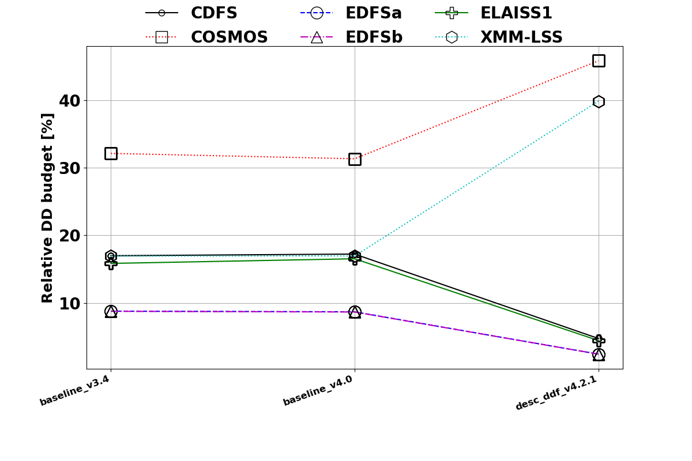
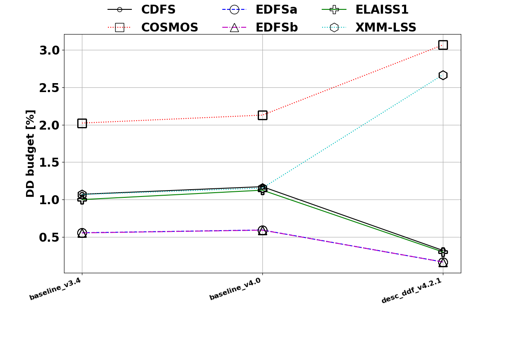
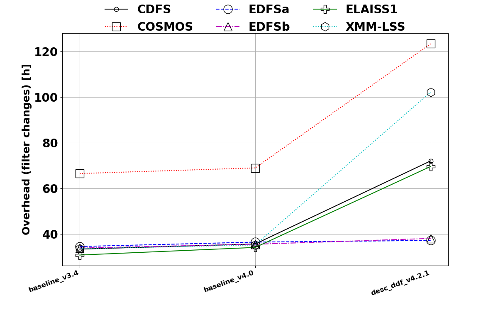
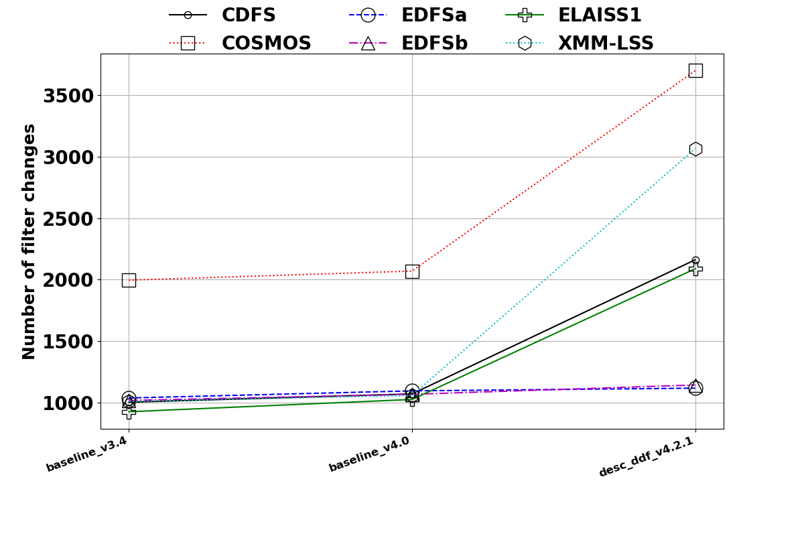
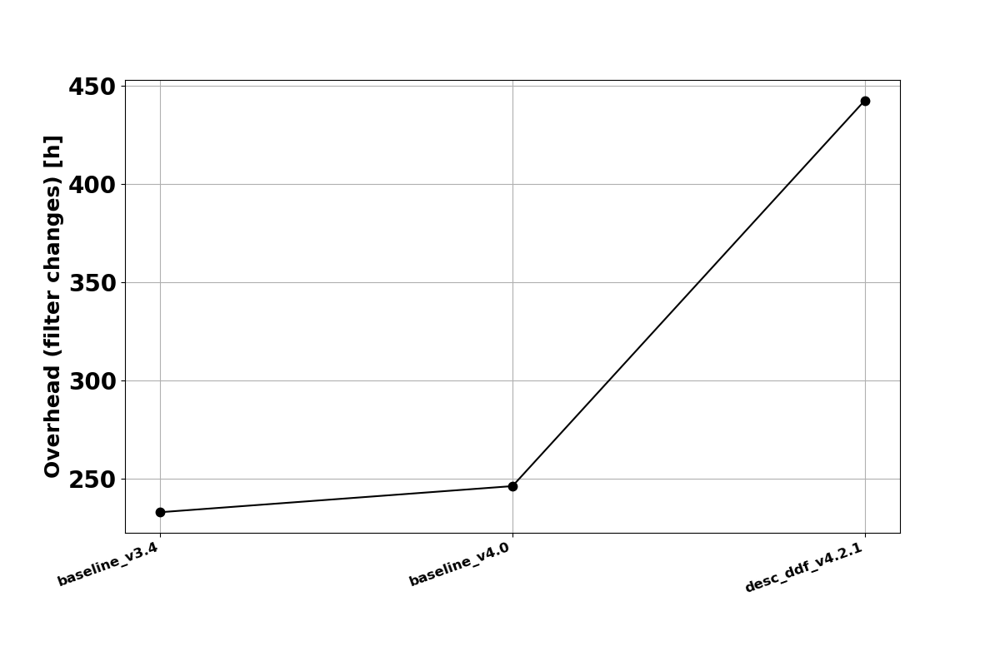
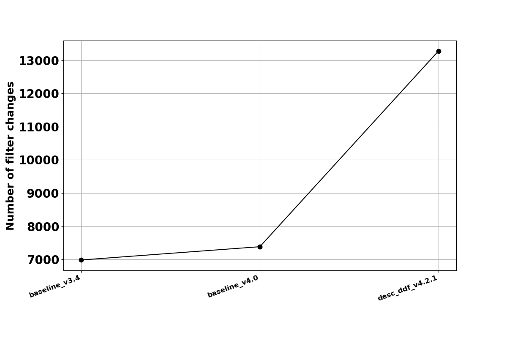
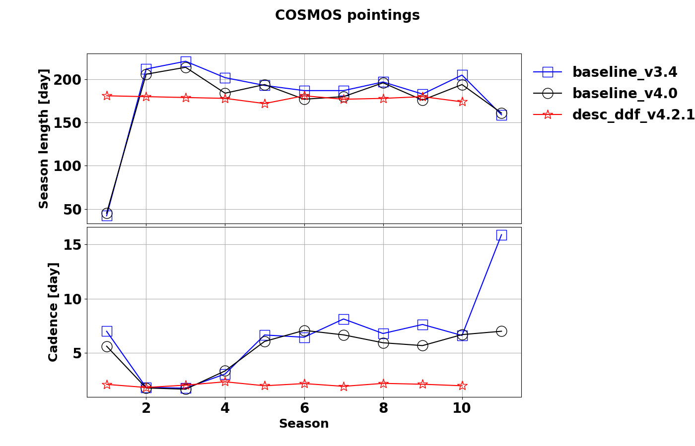
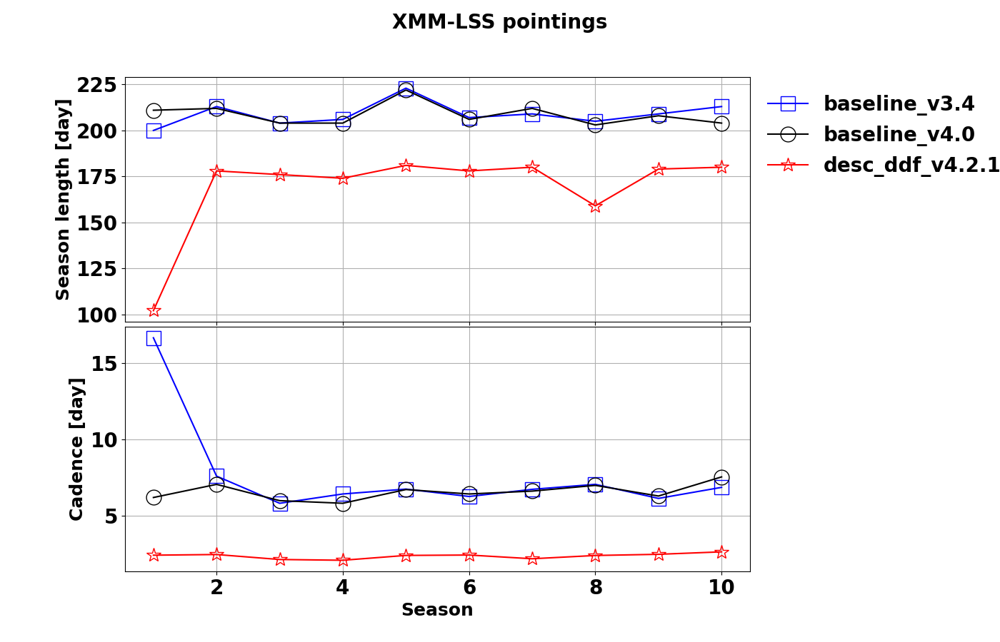
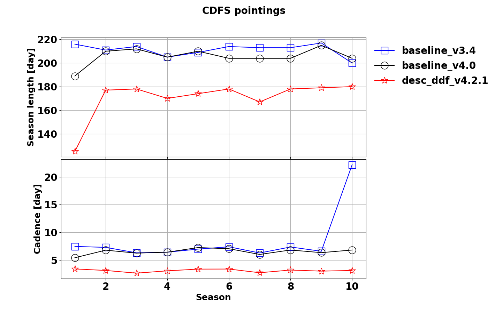
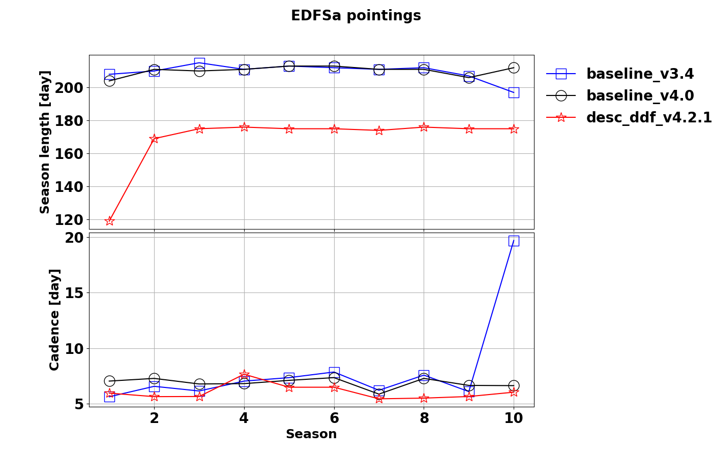
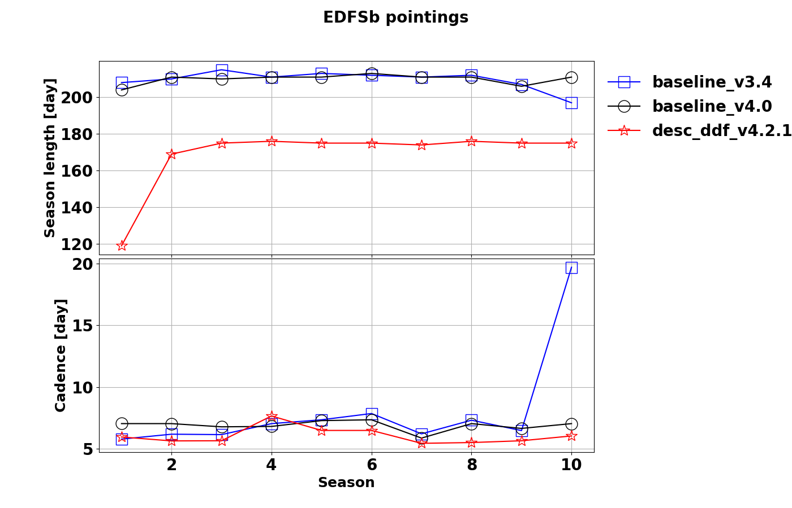
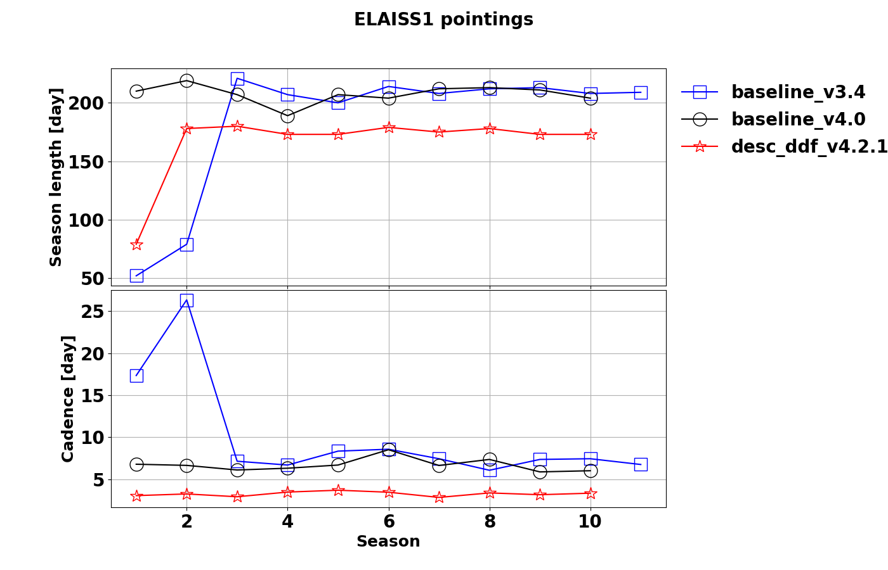
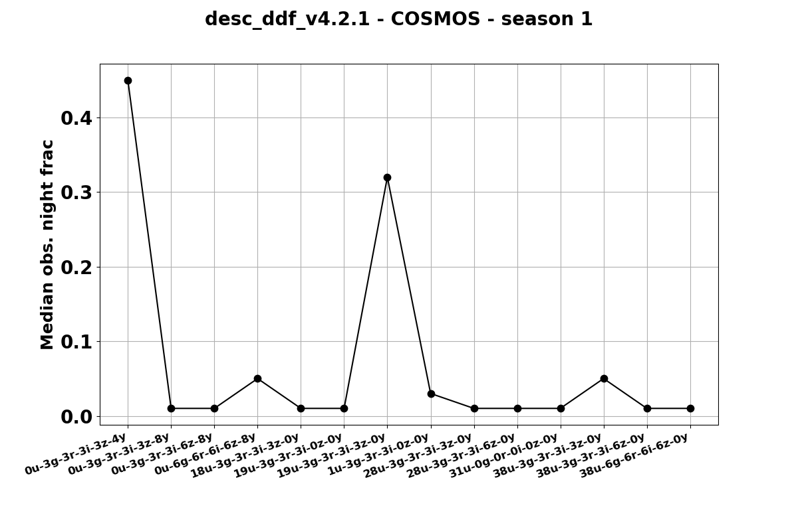
